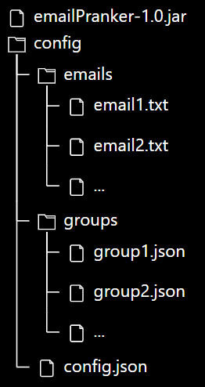

# Descritpion du projet
Dans le cadre du cours de développement d'application internet (API) suivi à la HEIG-VD d'Yverdon-les-bains, nous avons 
été amené au cours du projet-ci à développer une application client envoyant des emails forgés à un serveur mail mocké 
via le protocole SMTP. La contrainte majeure étant que la communication client-serveur est faite exclusivement via 
l'utilisation de sockets afin de mieux comprendre le protocole SMTP en particulier les différentes commandes principales 
permettant l'envoie de d'emails, ainsi que les différentes contraintes liées à l'encodage. Ce projet a également permis 
d'affirmer notre compréhension de la gestion de la lecture et écriture dans des fichiers externes.
<br> <br>
En bref, cette application permet d'envoyer des mails donnés à des groupes de victimes tout en se faisant passer pour
quelqu'un d'autre. Génial, non ?

# Qu'est-ce que MockMock ?
Puisque nous ne développons qu'un client. Nous avons besoin d'un serveur mail mocké sur lequel nous pouvons réaliser
notre expérience en tout impunité. Pour ce faire, nous utilisons un projet Github externe appelé 
[MockMock](https://github.com/tweakers/MockMock). Ce repo met à disosition un exécutable JAR lançant un serveur mail SMTP
en local. Ce dernier ouvrira donc un port accessible via telnet en localhost permettant de communiquer directement avec
le serveur SMTP en plus d'un autre port permettant l'ouverture d'une interface graphique web où seront visible l'ensemble
des mails reçu par le serveur.

# Installation

## Pré-requis
Avant de pouvoir commencer à créer votre propre campagne de mails forgés, vous aurez besoin des outils suivant:
- Docker Desktop
- Version de JDK 18 ou supérieure
- Maven 3.8.6

Nous vous laissons regarder sur l'internet afin d'installer correctement ces outils :)

## Installtion du serveur SMTP
L'installation de la partie serveur de ce projet se fera via Docker. Nous partons du principe que l'installation de ce 
logiciel est fonctionnelle.<br>
Docker est un logiciel de conteneurisation permettant d'empacté un logiciel ainsi que l'ensemble de ses dépendance dans
un contenant qui peut facilement s'exporter sur diverses machines indépendamment de leur système d'exploitation.<br>
<br>
[Deux script](./docker) sont à disposition pour créer le conteneur Docker. Voici la marche à suivre:

1) Exécuter via une invite de commande le script [build-image.sh](./docker/build-image.sh)
2) Exécuter via une invite de commande le script [run-container.sh](./docker/run-container.sh)

Une fois les deux scripts réalisés, vous aurez accès au serveur mail via un navigateur via l'adresse 
[localhost:8080](http://localhost:8080/). Vous pourez également accéder via telnet au serveur via la commande 
```telnet localhost 25000``` 

## Installation de EmailPranker

### Génération de l'exécutable

Nous partons du principe que Java et Maven ont été installé correctement. Voici les étapes pour lancer notre client:

1) Clonez (via git) ou téléchargez puis décompressez EmailPranker
2) Ouvrez une invite de commande à la racine du projet
3) Exécutez la commande ```mvn clean package```
4) Récupérez le fichier ```.jar``` généré nommé __emailPranker-1.0.jar__ et mettez le dans un emplacement qui vous convient

### Arborescence de fichier
Il est important de créer et respecter l'arborescence de fichier suivante pour le bon fonctionnement de l'application:<br>


### Structure config.json
Ce fichier contiendra les diverses infos de configuration générale de l'application. En voici la structure à respecter:
```json
{
  "srv_ip": "127.0.0.1",
  "srv_port": 25000,
  "mail_path": ".\\config\\emails", 
  "group_path": ".\\config\\groups", 
  "ehlo_msg": "my-domain.ch"
}
```

### Structure group.json
Ce fichier contient la configuration des différents groupes. Vous pouvez créer autant de fichier que vous désirez de 
groupe. Chaque groupe devra contenir cette structure précisément:

```json
{
  "mail_from": "prenom-de-l-envoyeur@domaine.ch", 
  "mail_to": [
    "victime1@domaine2.ch",
    "victime2@domaine3.ch", 
    "victime3@domaine4.ch"
  ]
}
```

### Structure email.txt
Ce fichier contient le sujet ainsi que le corps de l'email. Vous pouvez créer autant de fichier que vous désirez de mails
différents. La première ligne de ce fichier sera utilisée comme sujet du mail.
```text
Voici le sujet de votre mail

Et à partir de là, ça sera le corps
Il peut être écrit sur plusieurs lignes.
Il sera encodé en UTF-8.

N'hésitez pas à vous amuser !
```

# Exécution d'EmailPranker
Une fois toutes les étapes précédentes réalisées, il ne reste plus qu'à exécuter votre ```.jar```.
Pour ce faire, ouvrez une invite de commande où se trouve votre ```emailPranker-1.0.jar``` et exécuter la commande
```java -jar emailPranker-1.0.jar```. Si la console vous confirme que l'exécution s'est déroulée avec succès, vous
devriez voir les mails envoyés sur votre serveur en local.

# Implémentation
### Config JSON 
Puisque la contrainte majeur était de réaliser l'application en s'assurant de ne disposer d'aucune valeur inscrite en
dur mais via des fichiers de configurations, nous avons opté pour l'installation de la librairie Gson de Google, nous
obligeant par la même occasion à réaliser un projet maven. <br>
Dès lors, la suite de notre application se découpe en plusieurs classes. Tout d'abord, nous utilisons les classes "Config"
et "Group" pour "convertir" nos fichiers json en objets. En effet, du moment que ces classes répondent à certains critères
(notamment que tous les attributs soient public), la librairie gson offre une fonction permettant de "mapper" un json et 
sa classe correspondante.

### Mails 
En ce qui concerne les mails, nous avons préféré l'utilisation simple de fichiers texte, tout en faisant le choix
d'interpréter la première ligne d'un mail comme étant le sujet.

### Main 
Cette classe contient le programme main() qui sera executé au lancement de notre programme. Son rôle est de parser le fichier
de configuration initialisé par l'utilisateur et créer les objets qui en découlent (groupes, liste emails, ...) 
pour pouvoir les envoyer à EmailPrankRunner.
Il doit également initialisé le socket de communication TCP.

### EmailPrankerRunner 
Au final, c'est cette classe qui execute l'attaque.
Elle récupère toutes les informations nécessaires de Main (passés en paramètre à la fonction sendPrank()) et s'occupe
de forger un courrier en passant par toutes les étapes d'une communication SMTP (EHLO, MAIL FROM, ...)
Toutes ces étapes sont séparées dans des fonctions afin de facilité le debugging.
La fonction readSrvResponse(), quant à elle, est utilisée pour récupérer les valeurs retournées par le serveur MockMock
et les comparer avec les réponses attendues (stockées dans la classe StatusCodes). 
C'est elle qui lève l'exception en cas de problème.